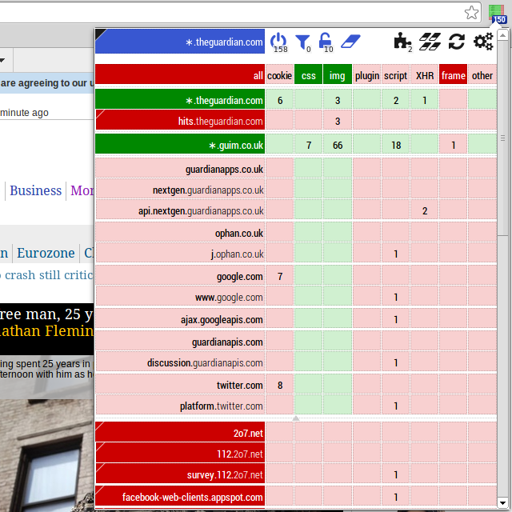

#HTTP Switchboard for Chromium

See [Change log](https://github.com/gorhill/httpswitchboard/wiki/Change-log) for latest changes.

A Chromium browser extension which let you white- or blacklist requests
originating from within a web page according to their type and/or destination
as per domain name.

##Installation

Available on Chrome web store (<a href="https://chrome.google.com/webstore/detail/httpswitchboard/mghdpehejfekicfjcdbfofhcmnjhgaag">HTTP Switchboard</a>),
or you can [install manually](https://github.com/gorhill/httpswitchboard/tree/master/dist).

##Documentation

HTTP Switchboard let you easily whitelist/blacklist net requests which originate from
 within a web page according to:

- domain names
  * in full or part
- type of requests
  * cookie
  * image
  * object
  * script
  * XMR (abbreviation for XMLHttpRequest)
  * frame
  * other

The goal of this extension is to make allowing or blocking of web sites,
wholly of partly, as straightforward as possible, so as to not discourage
those users who give up easily on good security and privacy habits.

The extension is also useful to see what the web page in your browser
is doing (or trying to do) behind the scene.

The number which appear in the extension icon correspond to the total number
of **distinct** requests attempted (successfully or not depending on whether it was
whitelisted/blacklisted) behind the scene.

Simply click on the appropriate entry in the matrix in order to whitelist,
blacklist or graylist a component. *Graylisting* means the blocked or allowed
status will be inherited from another entry in the matrix.

- Redish square = effectively blacklisted, i.e. requests are prevented from
reaching their destination:
    * Dark red square: the specific domain name and/or type of request is
specifically blacklisted.
    * Pale red square: the blacklist status in inherited because the entry is
graylisted.
- Greenish square = effectively whitelisted, i.e. requests are allowed to reach
their intended destination:
    * Bright green square = the specific domain name and/or type of request is
specifically whitelisted.
    * Pale green square = the whitelist status in inherited because the entry is
graylisted.

The top-left cell in the matrix represents the default global setting (the
'master switch'), which allows you to choose whether allowing or blocking
everything is the default behavior.

Whether a graylisted cell in the matrix is effectively whitelisted/blacklisted
depends on whether a cell with lower precedence is expressly
whitelisted/blacklisted. The precedence order works this way, from higher to
lower:

- Specific domain and specific type of request (i.e. 'cookie' @ 'edition.cnn.com')
- Domain names, which are subject to a another rule of precedence order within themselves:
    - ...
    - Subdomain names (i.e. 'ichef.bbc.co.uk')
    - Domain names (i.e. 'bbc.co.uk')
- Types of request (cells in the the top row)
- Master switch (the *all* cell in the top-left corner)

This extension is also useful if you wish to speed up your browsing, by
blocking all requests for images as an example.

This is a very early draft, but it does the job. I intend to keep working on
it until I am satisfied that it can be tagged as version 1.0.

##License

<a href="https://github.com/gorhill/httpswitchboard/blob/master/LICENSE.txt">GPLv3</a>.
