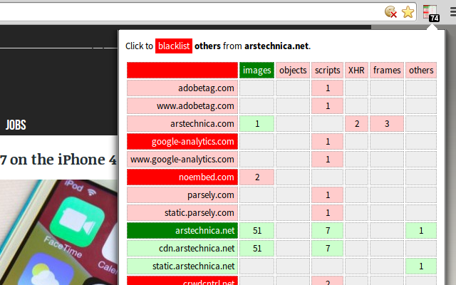

#HTTP Switchboard for Chromium

Change log at [[wiki/Change-log]].

A Chromium browser extension which let you white- or blacklist requests
originating from within a web page according to their type and/or destination
as per domain name.

##Installation

Available on Chrome web store (<a href="https://chrome.google.com/webstore/detail/httpswitchboard/mghdpehejfekicfjcdbfofhcmnjhgaag">HTTP Switchboard</a>),
or you can copy the content of this git to:

    {chromium folder on your machine}/Default/Extensions/mghdpehejfekicfjcdbfofhcmnjhgaag

##Documentation

HTTP Switchboard let you easily white- or black-list net requests which originate from
 within a web page according to:

- domain names
  * in full or part
- type of requests
  * images
  * objects
  * scripts
  * XMR (abbreviation for XMLHttpRequest)
  * sub-frames
  * others

The goal of this extension is to make allowing or blocking of web sites,
wholly of partly, as straightforward as possible, so as to not discourage
those users who give up easily on good security habits.

The extension is also useful to understand what the web page in your browser
is doing behind the scene.

The number which appear in the extension icon correspond to the total number
of requests attempted (successfully or not depending on whether it was
white- or black-listed) behind the scene.

Simply click on the appropriate entry in the matrix in order to white-,
black- or gray-list a component. Gray-listing means the blocked or allowed
status will be inherited from another entry in the matrix.

Red square: effectively black-listed, i.e. requests are prevented from
reaching their destination.

Green square: effectively white-listed, i.e. requests are allowed to reach
their intended destination.

Bright red square: the specific domain name and/or type of request is
specifically black-listed.

Faded red square: the black-list status in inherited because the entry is
gray-listed.

Bright green square: the specific domain name and/or type of request is
specifically white-listed.

Faded green square: the white-list status in inherited because the entry is
gray-listed.

The top-left cell in the matrix represents the default global setting, which
allows you to choose whether allowing or blocking everything is the default
behavior. Some prefer to allow everything while blocking exceptionally.
My personal preference is of course the reverse, blocking everything and
allowing exceptionally.

This extension is also useful if you wish to speed up your browsing, by
blocking all requests for images as an example.

This is a very early draft, but it does the job. I intend to keep working on
it until I am satisfied that it can be tagged as version 1.0.

##License

<a href="https://github.com/gorhill/httpswitchboard/blob/master/LICENSE.txt">GPLv3</a>.
